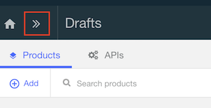

# Publish your WebSphere Liberty APIs Via API Connect


With IBM® WebSphere® Connect, you can connect your IBM WebSphere Application Server apps and data to the cloud in minutes without rewriting apps or acquiring new data. Designed specifically for your WebSphere Application Server environment, these capabilities give you the flexibility to respond to business changes at scale by using your apps and data wherever they are located, whether on-premises or on the cloud.

This tutorial teaches you how to deploy your on-premises IBM WebSphere Liberty V9 workloads onto the cloud, creating a highly available and sharable API environment. It also discusses in detail how to expose those APIs through IBM API Connect, available free on IBM Bluemix, allowing you to further manage and secure your API assets. You learn the end-to-end process, starting with pushing a WebSphere Liberty package into IBM Bluemix and setting up the API Connect service on IBM Bluemix.

## Included Components

- [WebSphere Liberty](https://developer.ibm.com/wasdev/websphere-liberty/)
- [API Connect](http://www-03.ibm.com/software/products/en/api-connect)

## References

This WebSphere API Connect example is based on this developerWorks [article](https://www.ibm.com/developerworks/library/mw-1609-demagalhaes-bluemix-trs/1609-demagalhaes.html).

## Steps
1. [Push a WebSphere Liberty API Discovery server into Bluemix](#1-push-bluemix)
2. [Create an API Connect service in Bluemix](#2-create-bluemix)
3. [Pull WebSphere Liberty APIs from API Connect](#3-pull-connect)

[Troubleshooting](#troubleshooting)

# 1. Push a WebSphere Liberty API Discovery server into Bluemix

First login to Cloud Foundry

```bash
cf login -a https://api.ng.bluemix.net
```

Then you can push your WebSphere Liberty server into the cloud straight from your current local file structure. However, depending on how large your logs and work area directories are, you might want to isolate your files in the following structure: `apps folder` `server.xml file`

In the apps folder, place your enterprise archive (EAR) files or web archive (WAR) files. In the server.xml file, make sure that you have all the same configuration used in the on-premises environment, remembering to configure the API Discovery feature to expose your APIs.

For this example, we provided you an example web archive and server.xml file in the **defaultServer** folder.

Replace `<app_name>` with an unique application name within your Bluemix region. This application name is the name of your API container.

```bash
cf push <app_name> -p defaultServer
```

To reach the API Discovery user interface, go to **https://<app_name>.mybluemix.net/ibm/api/explorer**. Then, use the credentials from your server.xml to login(For this example, the **username** is `user` and the **password** is `demo`).

You should see something like this in your API Discovery user interface.


As shown in the following screen capture, you can click the **Try it out** button, which starts your application, running on the cloud.


# 2. Create an API Connect service in Bluemix

To add API Connect as a Bluemix service, go to the bluemix [API Connect service](https://console.ng.bluemix.net/catalog/services/api-connect?taxonomyNavigation=services)


Then, select the **Essentials plan** and click **Create**.

Go to dashboard by clicking here



By default, an empty catalog called **Sandbox** is created. To enable its corresponding developer portal, click **Sandbox** then **Settings**.

Click **Portal**, and then under **Portal Configuration**, select **IBM Developer Portal**. A Portal URL is automatically inserted.

Take note of the Portal URL, which reveals the target server address and organization that you need later. The URL is broken down into the following three parts, as shown in the following screen capture: 


- 1 is the catalog's short name, in this case, sb.
- 2 is your organization ID, in the example, arthurdmcaibmcom-dev.
- 3 is the target address of your API Connect instance, for example, https://us.apiconnect.ibmcloud.com.

Click Save at the top right corner. You see the following message:
```
Creating the developer portal... Creating the developer portal for catalog "Sandbox" may take a few minutes. You will receive an email with the portal is available.
```

After you received the email, go to the **Portal URL** and you will see something like this.


This is where enterprise developers go to find the products (for example, an API or a group of APIs) that are exposed in the API catalog. Developers also can interact with each other through the Blogs and Forums links.

# 3. Pull WebSphere Liberty APIs from API Connect

From the main API Connect dashboard in Bluemix, click the menu icon and select **Drafts**. Click **APIs**, click **Add**, and select **Import API from a file or URL**.


In the **Import API from a file or URL** window, click **Or import from URL**.

For the URL, type the Liberty URL that you want to use to import the Swagger document. For this example, you can use **https://<app_name>.mybluemix.net/ibm/api/docs/apiconnect**

Click **All APIs** to go back into the main Drafts page, Click **Products**, and then click **Add > New Product**. In the Add a new product window, type in a title (could be anything) and then click **Add**.

The design view opens for the Product. Scroll down to the APIs section and click on the + icon. 


Select the API you just imported, and click **Apply**.

In the Plans section, you can create different plans with different rate limits, to control which methods from each API are exposed. For this example, please use the default plan.

Click the **save icon** to save your changes.

Now you are ready to stage your Product into a catalog. Click the **cloud icon** and select the catalog where you want to stage the APIs.

To go back into the catalog, click the menu icon , and select **Dashboard**. Then click the menu icon for your staged product and select **Publish**.


In the new window that opens, you can edit who can view your APIs and who can subscribe to your API Plans. For this example, use the defaults and click **Publish**.

Congratulation. You API is published. Now explore the API Connect Developer Portal like consumers of your API do. Go to **https://<app_name>.mybluemix.net/ibm/api/docs/apiconnect** and click **API Products**.

Now you can go to your API and try it out at the API Connect Developer Portal.


# Troubleshooting
### Clean up your Bluemix space

Go back to the initial dashboard by clicking the **IBM Bluemix** icon at the top left corner of the page, and click **All Items**. Scroll down to the Cloud Foundry Applications section and locate the application you want to delete. Click the menu icon, and then select **Delete App**.

Carefully read the window that describes the routes that are about to be deleted with the application, and then click **Delete**.

Now remove the API Connect service. Scroll down to Services, and locate the API Connect service to delete. Click the menu icon and then select **Delete Service**.

A confirmation window opens, describing that all data (APIs, Products, and subscriptions) stored in that API Connect service are to be removed. Click **Delete**.


# License

[Apache 2.0](LICENSE)

